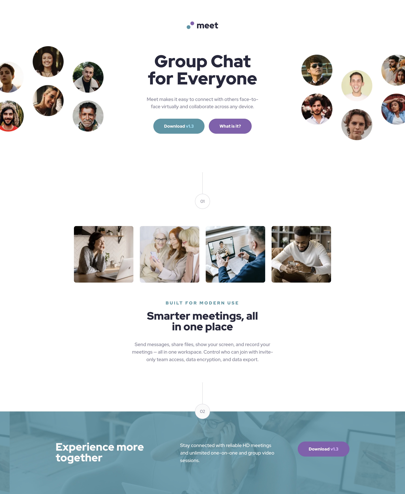

# Frontend Mentor - Meet landing page solution

This is a solution to the [Meet landing page challenge on Frontend Mentor](https://www.frontendmentor.io/challenges/meet-landing-page-rbTDS6OUR). Frontend Mentor challenges help you improve your coding skills by building realistic projects. 

## Table of contents

- [Overview](#overview)
  - [The challenge](#the-challenge)
  - [Screenshot](#screenshot)
  - [Links](#links)
- [My process](#my-process)
  - [Built with](#built-with)
  - [Continued development](#continued-development)
- [Author](#author)

## Overview

### The challenge

Users should be able to:

- View the optimal layout depending on their device's screen size
- See hover states for interactive elements

### Screenshot

### Links

- Solution URL: [github.com/tloyan/frontendmentor-meet-landing-page](https://github.com/tloyan/frontendmentor-meet-landing-page)
- Live Site URL: [meet-landing-page.tloyan.com](https://meet-landing-page.tloyan.com/)

## My process

### Built with

- [React](https://react.dev/)
- [Next.js](https://nextjs.org/)
- [TypeScript](https://www.typescriptlang.org/)
- [Tailwind CSS](https://tailwindcss.com/)

### Continued development

I need to adjust my perspective a bit. My approach with Tailwind isn’t completely wrong, but it could be better. I should start thinking more in terms of atomicity, using a component-based approach and atomic design principles. For example, I should probably create components like Button, Title, Paragraph, and so on. I’m considering trying Storybook, even if it feels a bit overkill, but after all, we’re here to practice and learn new things.

## Author

- Website - [Thomas Loyan](https://www.thomasloyan.com)
- Frontend Mentor - [@tloyan](https://www.frontendmentor.io/profile/tloyan)